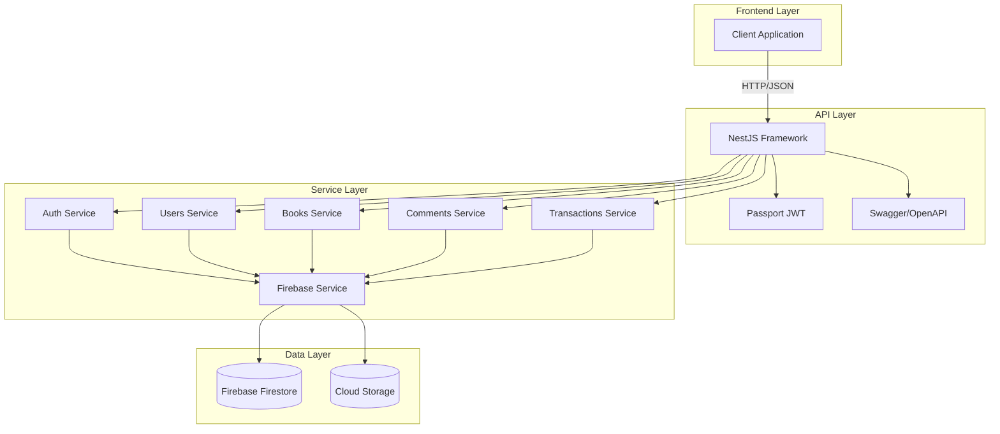
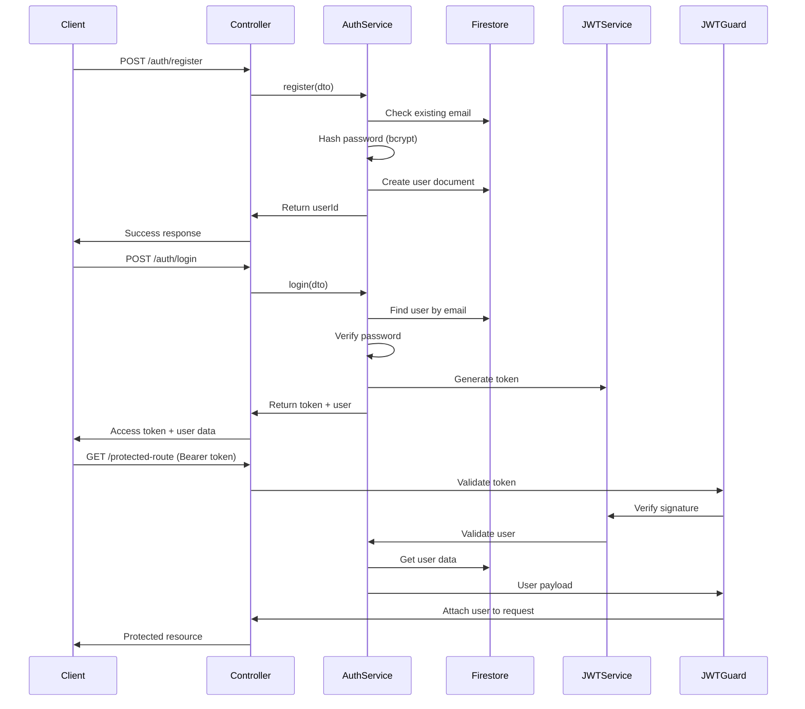
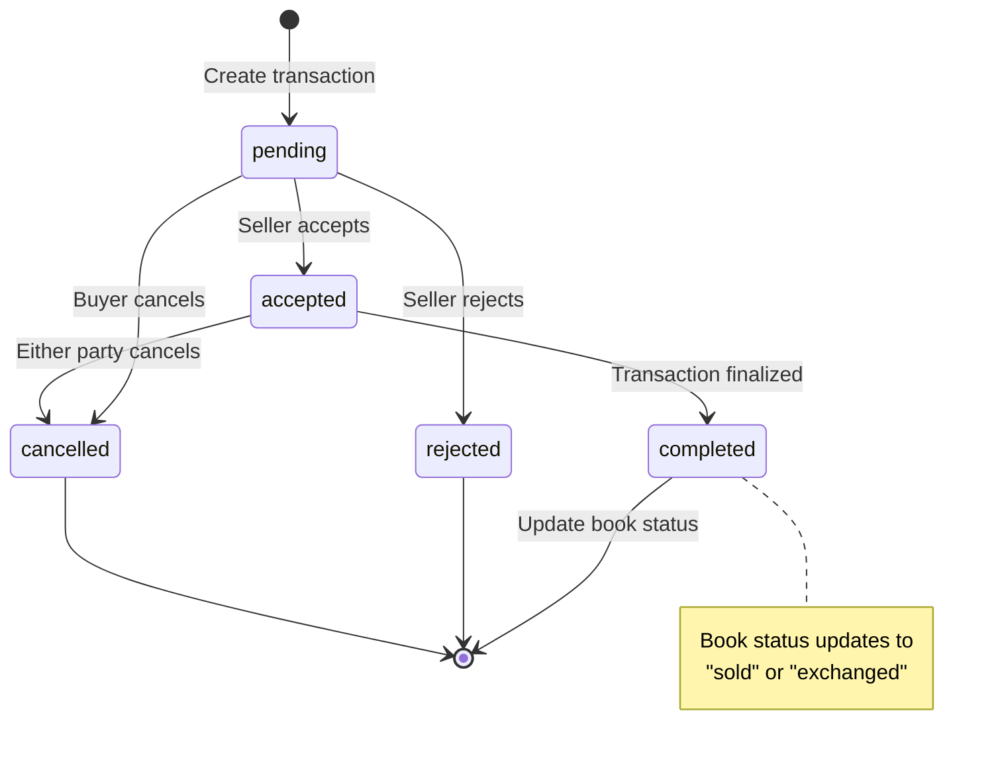
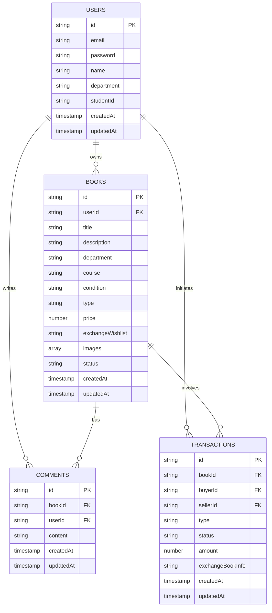

# UTaipei BookXchange API

A RESTful API backend for a second-hand book exchange platform designed for Taipei Municipal University students. Built with NestJS, Firebase Firestore, and Firebase Cloud Storage.

## Project Overview

UTaipei BookXchange enables university students to buy, sell, and exchange textbooks within their academic community. The platform facilitates peer-to-peer transactions while maintaining user privacy and security through JWT-based authentication.

### Key Features

- **User Authentication**: Secure registration and login with JWT tokens and bcrypt password hashing
- **Book Listings**: Create, read, update, and delete book listings with image upload support
- **Multiple Transaction Types**: Support for selling, exchanging, or both transaction modes
- **Advanced Filtering**: Search books by department, course, type, and availability status
- **Public Comments**: Community discussion system for book listings
- **Transaction Management**: Complete workflow from initiation to completion with status tracking
- **Image Storage**: Upload up to 5 images per book (5MB each) to Firebase Cloud Storage
- **API Documentation**: Interactive Swagger/OpenAPI documentation

## File Structure

```
api-utaipei-book-xchange/
├── src/
│   ├── auth/                   # Authentication (JWT, registration, login)
│   ├── users/                  # User profile management
│   ├── books/                  # Book listings and image uploads
│   ├── comments/               # Comment system for books
│   ├── transactions/           # Transaction workflow management
│   ├── firebase/               # Firebase Admin SDK configuration
│   ├── common/                 # Shared guards, decorators, filters
│   ├── app.module.ts
│   └── main.ts
├── test/                       
├── .env.example                # Environment configuration template
├── package.json
└── tsconfig.json
```

## System Architecture

### Technology Stack



### Authentication Flow



### Transaction State Machine



### Data Model



## Quick Start

### Prerequisites

- Node.js (v18 or higher)
- pnpm (v8 or higher)
- Firebase project with Firestore and Cloud Storage enabled

### Installation

1. Clone the repository:
```bash
git clone <repository-url>
cd api-utaipei-book-xchange
```

2. Install dependencies:
```bash
pnpm install
```

3. Configure environment variables:
```bash
cp .env.example .env
```

Edit `.env` with your Firebase credentials:
```env
FIREBASE_PROJECT_ID=your-project-id
FIREBASE_PRIVATE_KEY=your-private-key
FIREBASE_CLIENT_EMAIL=your-client-email
FIREBASE_STORAGE_BUCKET=your-bucket-name
JWT_SECRET=your-jwt-secret-key
PORT=3000
NODE_ENV=development
```

### Development

Start the development server with hot reload:
```bash
pnpm run dev
```

The API will be available at:
- API Endpoints: `http://localhost:3000/api`
- Swagger Documentation: `http://localhost:3000/api/docs`

### Build and Production

Build the application:
```bash
pnpm run build
```

Run in production mode:
```bash
pnpm run start:prod
```

### Testing

Run unit tests:
```bash
pnpm run test
```

Run tests with coverage:
```bash
pnpm run test:cov
```

Run end-to-end tests:
```bash
pnpm run test:e2e
```

### Code Quality

Format code with Prettier:
```bash
pnpm run format
```

Lint code with ESLint:
```bash
pnpm run lint
```

### API Endpoints

After starting the server, explore the interactive API documentation at `http://localhost:3000/api/docs` for detailed endpoint information, request/response schemas, and authentication requirements.

Key endpoint groups:
- `/api/auth` - Authentication (register, login)
- `/api/users` - User profile management
- `/api/books` - Book listing operations
- `/api/comments` - Comment management
- `/api/transactions` - Transaction workflow

---

**License**: UNLICENSED
**Framework**: NestJS 11.x
**Database**: Firebase Firestore
**Storage**: Firebase Cloud Storage
